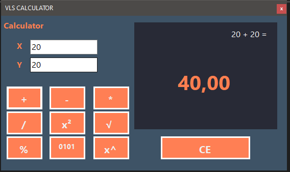
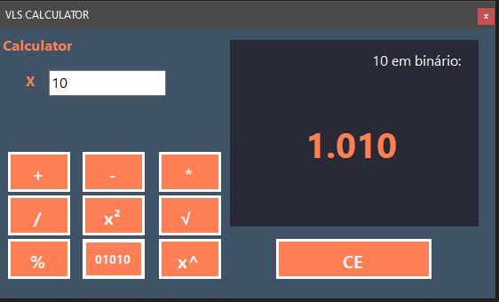
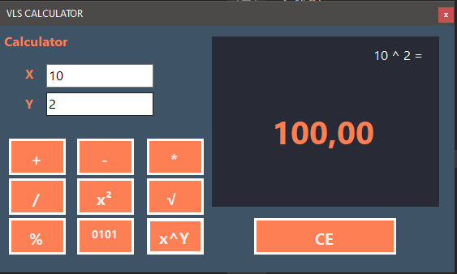

# VLS Calculator 

Este é um simples projeto, feito em `Windows Forms` com `C#`, de uma calculadora de operações básicas da matemática.

## 💻 Demosntração do programa:

### 🔵 Funções extras:

- Conversão de decimal para binário: 

- X elevado a potência de Y:

Baixe a versão do programa [aqui](#)